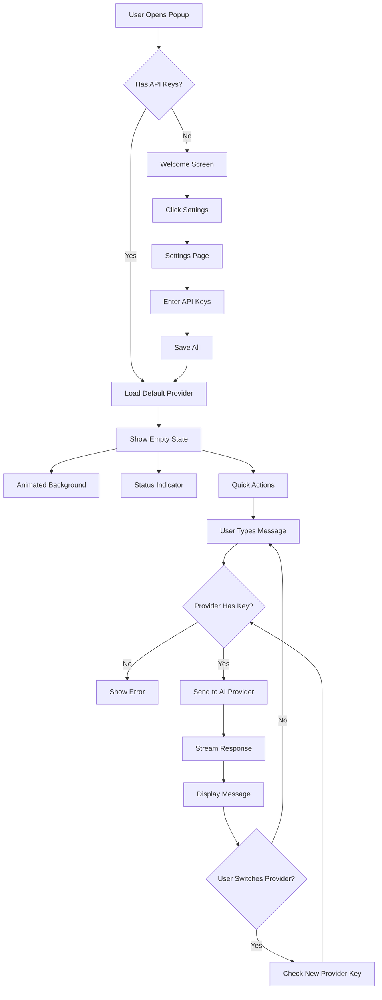
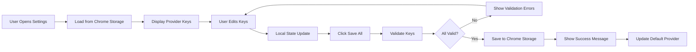

# Extendy UI/UX Refactor - Architectural Plan

**Version:** 1.0  
**Date:** October 21, 2025  
**Author:** Architect Mode Analysis

---

## 1. Executive Summary

This document outlines the comprehensive architectural plan for refactoring the Extendy Chrome extension UI/UX to match the target designs. The refactor focuses on creating a visually striking, modern interface with animated gradients, improved component organization, and multi-provider API key management.

### Key Objectives
- Transform chat interface with dark mode gradient vortex effects
- Redesign settings page with multi-provider key management
- Implement smooth animations and visual depth
- Maintain Chrome extension performance constraints
- Preserve existing functionality while enhancing UX

---

## 2. Current Architecture Analysis

### 2.1 Component Structure

```
src/
├── popup/
│   ├── main.tsx (Entry point)
│   └── popupApp.tsx (400x600px popup container)
├── sidebar/
│   ├── main.tsx (Entry point)
│   └── SidebarApp.tsx (Full height sidebar)
├── options/
│   ├── main.tsx (Entry point)
│   └── OptionsApp.tsx (Settings page)
├── components/
│   ├── Button.tsx (Reusable button with variants)
│   ├── Input.tsx (Form input with validation)
│   ├── ChatBoxWithAI.tsx (Main chat interface)
│   └── Icons.tsx (SVG icon library)
├── hooks/
│   ├── useAIChat.ts (Chat state & API calls)
│   └── useTheme.ts (Theme management)
├── providers/
│   └── aiProvider.ts (Unified AI provider interface)
└── config/
    └── providers.ts (Provider configurations)
```

### 2.2 Current State Management

**Storage Strategy:**
- Chrome storage for: `provider`, `token`, `theme`
- Local React state for: messages, UI state, loading states
- No global state management (Context/Redux)

**Data Flow:**
1. User settings → Chrome Storage
2. Component mount → Read from storage
3. User interaction → Update local state + Chrome storage
4. AI interaction → useAIChat hook → aiProvider

### 2.3 Styling Architecture

**Current Approach:**
- Tailwind CSS for utility classes
- Custom CSS in `styles.css` with CSS variables
- Theme switching via `data-theme` attribute
- Dark mode support via CSS variables

### 2.4 Identified Gaps

1. **Visual Effects:** No animated gradients or vortex effects
2. **Empty State:** Basic empty state, needs "AI Assistant Ready" with status indicator
3. **Settings Page:** Single provider/token pair, needs multi-provider support
4. **Model Selection:** Simplified, needs proper model filtering by provider
5. **Quick Actions:** No prominent action buttons like "Summarize the Current Page"
6. **Visual Depth:** Minimal shadows and depth effects

---

## 3. Target Design Analysis

### 3.1 Image 3 - Chat Interface Design

**Visual Elements:**
- **Background:** Dark theme with animated radial gradient (purple/blue/pink)
- **Status Indicator:** "AI Assistant Ready" with animated cyan dot
- **Header:** Large "START CHATTING" text with subtitle
- **Action Button:** Prominent "Summarize the Current Page" with cyan gradient
- **Input Area:** Modern input with "Ask anything..." placeholder
- **Model Selection:** Two dropdowns (Provider: "Gemini", Model: "Gemini 2.5 Flash")
- **Controls:** Settings icon, Send button
- **Visual Style:** Modern, high contrast, depth with shadows

**Design Principles:**
- Visual hierarchy with large headings
- Gradient-based CTAs for attention
- Status indicators for system state
- Accessible contrast ratios
- Smooth animations for engagement

### 3.2 Image 4 - Settings Page Design

**Visual Elements:**
- **Theme:** Light mode with white/gray backgrounds
- **Header:** "Assistant Settings" with theme toggle
- **Provider Section:** 
  - Purple/blue gradient banner with "Save all" button
  - Input fields for 5 providers:
    - Google Gemini (with "Get key" link)
    - OpenAI (with "Get key" link)
    - Anthropic (with "Get key" link)
    - Ollama (with "Install Ollama" link)
    - Perplexity (with "Get key" link)
- **Advanced Section:** "ADVANCED SETTINGS" header with toggles
- **Privacy Info:** Privacy & Security text block
- **Layout:** Clean, organized, professional

**Design Principles:**
- Multi-provider support (5 providers)
- Contextual help links
- Grouped settings sections
- Clear visual hierarchy
- Professional appearance

---

## 4. Proposed Architecture

### 4.1 Component Hierarchy

```
┌─────────────────────────────────────────────┐
│           PopupApp / SidebarApp             │
├─────────────────────────────────────────────┤
│ ┌─────────────────────────────────────────┐ │
│ │         Header Component                 │ │
│ │  - Logo, Title, Theme Toggle, Settings  │ │
│ └─────────────────────────────────────────┘ │
│ ┌─────────────────────────────────────────┐ │
│ │      Chat Interface Component           │ │
│ │  ┌───────────────────────────────────┐  │ │
│ │  │   Empty State / Welcome Screen    │  │ │
│ │  │  - Animated Background            │  │ │
│ │  │  - Status Indicator               │  │ │
│ │  │  - Start Chatting Header          │  │ │
│ │  │  - Quick Action Buttons           │  │ │
│ │  └───────────────────────────────────┘  │ │
│ │  ┌───────────────────────────────────┐  │ │
│ │  │   Message List Component          │  │ │
│ │  │  - Message Bubbles                │  │ │
│ │  │  - Streaming Indicator            │  │ │
│ │  │  - Timestamps                     │  │ │
│ │  └───────────────────────────────────┘  │ │
│ └─────────────────────────────────────────┘ │
│ ┌─────────────────────────────────────────┐ │
│ │      Input Area Component               │ │
│ │  - Text Input                           │ │
│ │  - Send Button                          │ │
│ │  - Provider Selector                    │ │
│ │  - Model Selector                       │ │
│ │  - Settings Icon                        │ │
│ └─────────────────────────────────────────┘ │
└─────────────────────────────────────────────┘

┌─────────────────────────────────────────────┐
│            OptionsApp                       │
├─────────────────────────────────────────────┤
│ ┌─────────────────────────────────────────┐ │
│ │      Settings Header                    │ │
│ │  - Title, Theme Toggle                  │ │
│ └─────────────────────────────────────────┘ │
│ ┌─────────────────────────────────────────┐ │
│ │      Provider Keys Section              │ │
│ │  - Gradient Banner with "Save All"      │ │
│ │  - ProviderKeyInput x5                  │ │
│ │    (Gemini, OpenAI, Anthropic,         │ │
│ │     Ollama, Perplexity)                │ │
│ └─────────────────────────────────────────┘ │
│ ┌─────────────────────────────────────────┐ │
│ │    Advanced Settings Section            │ │
│ │  - Stream Responses Toggle              │ │
│ │  - Other Configuration Options          │ │
│ └─────────────────────────────────────────┘ │
│ ┌─────────────────────────────────────────┐ │
│ │    Privacy & Security Info              │ │
│ └─────────────────────────────────────────┘ │
└─────────────────────────────────────────────┘
```

### 4.2 New Component Specifications

#### 4.2.1 AnimatedBackground Component

**Purpose:** Renders the gradient vortex background effect

**Props:**
```typescript
interface AnimatedBackgroundProps {
  variant: 'vortex' | 'subtle' | 'none'
  colors?: string[]
  animationSpeed?: 'slow' | 'medium' | 'fast'
  className?: string
}
```

**Implementation:**
- CSS-based animations using `@keyframes`
- Radial gradients with multiple color stops
- Transform animations (rotate, scale)
- Opacity variations for depth
- Position: absolute, behind content (z-index: 0)

**Technical Approach:**
```css
.animated-background {
  position: absolute;
  inset: 0;
  background: radial-gradient(
    circle at 50% 50%,
    rgba(139, 92, 246, 0.3) 0%,
    rgba(59, 130, 246, 0.2) 35%,
    rgba(236, 72, 153, 0.15) 70%,
    transparent 100%
  );
  animation: vortexRotate 20s ease-in-out infinite;
  filter: blur(40px);
}

@keyframes vortexRotate {
  0%, 100% { transform: rotate(0deg) scale(1); }
  33% { transform: rotate(120deg) scale(1.1); }
  66% { transform: rotate(240deg) scale(0.9); }
}
```

---

#### 4.2.2 StatusIndicator Component

**Purpose:** Shows AI readiness status with animated dot

**Props:**
```typescript
interface StatusIndicatorProps {
  status: 'ready' | 'processing' | 'error' | 'offline'
  label?: string
  size?: 'sm' | 'md' | 'lg'
  animated?: boolean
}
```

**States:**
- `ready`: Cyan pulsing dot + "AI Assistant Ready"
- `processing`: Yellow spinning dot + "Processing..."
- `error`: Red solid dot + "Connection Error"
- `offline`: Gray dot + "Offline"

**Implementation:**
```tsx
const StatusIndicator = ({ status, label, size = 'md', animated = true }) => {
  const statusConfig = {
    ready: { color: 'bg-cyan-400', pulse: true, label: 'AI Assistant Ready' },
    processing: { color: 'bg-yellow-400', pulse: false, label: 'Processing...' },
    error: { color: 'bg-red-400', pulse: false, label: 'Connection Error' },
    offline: { color: 'bg-gray-400', pulse: false, label: 'Offline' }
  }
  
  const config = statusConfig[status]
  const dotSize = size === 'sm' ? 'w-2 h-2' : size === 'lg' ? 'w-4 h-4' : 'w-3 h-3'
  
  return (
    <div className="flex items-center gap-2">
      <div className={`${dotSize} rounded-full ${config.color} ${
        config.pulse && animated ? 'animate-pulse' : ''
      }`} />
      <span className="text-sm font-medium">
        {label || config.label}
      </span>
    </div>
  )
}
```

---

#### 4.2.3 EmptyStateWithActions Component

**Purpose:** Replaces current empty state with prominent welcome screen

**Props:**
```typescript
interface EmptyStateWithActionsProps {
  onQuickAction?: (action: string) => void
  quickActions?: QuickAction[]
  showAnimatedBackground?: boolean
}

interface QuickAction {
  id: string
  label: string
  icon?: ReactNode
  gradient?: string
  description?: string
}
```

**Layout:**
1. Animated gradient background (full area)
2. Status indicator (top-center)
3. Large "START CHATTING" heading
4. Subtitle text
5. Quick action buttons (if provided)
6. Input prompt hint

**Implementation Structure:**
```tsx
<div className="relative h-full flex items-center justify-center">
  <AnimatedBackground variant="vortex" />
  
  <div className="relative z-10 text-center px-8 max-w-lg">
    <StatusIndicator status="ready" size="lg" />
    
    <h1 className="text-4xl font-bold mt-6 mb-3">
      START CHATTING
    </h1>
    
    <p className="text-gray-400 mb-8">
      Your AI assistant is ready to help with any task
    </p>
    
    {quickActions?.map(action => (
      <QuickActionButton key={action.id} {...action} />
    ))}
  </div>
</div>
```

---

#### 4.2.4 QuickActionButton Component

**Purpose:** Prominent CTA button for quick actions

**Props:**
```typescript
interface QuickActionButtonProps {
  label: string
  icon?: ReactNode
  gradient?: string
  onClick: () => void
  disabled?: boolean
  size?: 'md' | 'lg'
}
```

**Styling:**
- Gradient background (customizable)
- Large padding for prominence
- Hover scale effect
- Icon + text layout
- Shadow for depth

**Example:**
```css
.quick-action-button {
  background: linear-gradient(135deg, #06b6d4 0%, #22d3ee 100%);
  padding: 1rem 2rem;
  border-radius: 12px;
  font-weight: 600;
  font-size: 1.125rem;
  box-shadow: 0 8px 20px rgba(6, 182, 212, 0.4);
  transition: all 0.2s ease;
}

.quick-action-button:hover {
  transform: translateY(-2px);
  box-shadow: 0 12px 28px rgba(6, 182, 212, 0.5);
}
```

---

#### 4.2.5 ProviderKeyInput Component

**Purpose:** Individual provider API key input field

**Props:**
```typescript
interface ProviderKeyInputProps {
  provider: 'gemini' | 'openai' | 'anthropic' | 'ollama' | 'perplexity'
  value: string
  onChange: (value: string) => void
  helpLink?: string
  helpLinkText?: string
  icon?: ReactNode
}
```

**Features:**
- Provider logo/icon
- Input field with password type
- "Get key" or "Install" link
- Validation indicator
- Copy/paste support

**Layout:**
```tsx
<div className="flex items-center gap-3 p-4 bg-white rounded-lg border">
  <div className="w-10 h-10 rounded-lg bg-gradient flex items-center justify-center">
    {icon || <ProviderIcon provider={provider} />}
  </div>
  
  <div className="flex-1">
    <label className="text-sm font-semibold">{providerName}</label>
    <input
      type="password"
      value={value}
      onChange={e => onChange(e.target.value)}
      placeholder="Enter API key..."
      className="w-full mt-1"
    />
  </div>
  
  <a href={helpLink} className="text-blue-600 text-sm">
    {helpLinkText || "Get key"}
  </a>
</div>
```

---

#### 4.2.6 ModelSelector Component

**Purpose:** Provider and model selection dropdowns

**Props:**
```typescript
interface ModelSelectorProps {
  currentProvider: string
  currentModel?: string
  availableProviders: string[]
  onProviderChange: (provider: string) => void
  onModelChange?: (model: string) => void
  compact?: boolean
}
```

**Behavior:**
- Provider dropdown triggers model list update
- Model dropdown filtered by selected provider
- Displays saved API key status (checkmark/warning)
- Can be horizontal or vertical layout

**Implementation:**
```tsx
<div className="flex gap-2">
  <select
    value={currentProvider}
    onChange={e => handleProviderChange(e.target.value)}
    className="flex-1 px-3 py-2 rounded-lg bg-gray-50"
  >
    {availableProviders.map(p => (
      <option key={p} value={p}>
        {getProviderDisplayName(p)}
      </option>
    ))}
  </select>
  
  <select
    value={currentModel}
    onChange={e => onModelChange?.(e.target.value)}
    className="flex-1 px-3 py-2 rounded-lg bg-gray-50"
  >
    {getProviderModels(currentProvider).map(m => (
      <option key={m} value={m}>{m}</option>
    ))}
  </select>
</div>
```

---

### 4.3 Modified Component Specifications

#### 4.3.1 ChatBoxWithAI Refactor

**Current Issues:**
- Empty state is basic
- No prominent action buttons
- Model selector is minimal
- No animated background

**Proposed Changes:**

**Structure:**
```tsx
export default function ChatBoxWithAI({ currentProvider, onProviderChange }) {
  const [showWelcome, setShowWelcome] = useState(messages.length === 0)
  const [currentModel, setCurrentModel] = useState(defaultModel)
  
  return (
    <div className="h-full flex flex-col relative">
      {/* Animated Background - Only in dark mode & when no messages */}
      {showWelcome && theme === 'dark' && (
        <AnimatedBackground variant="vortex" />
      )}
      
      {/* Header with Status */}
      <div className="flex-shrink-0 px-4 py-3 border-b relative z-10">
        <div className="flex items-center justify-between">
          <StatusIndicator 
            status={isLoading ? 'processing' : 'ready'} 
            size="sm"
          />
          <div className="flex gap-2">
            <StreamToggle checked={useStreaming} onChange={setUseStreaming} />
            <ClearButton onClick={clearMessages} />
          </div>
        </div>
      </div>
      
      {/* Messages or Welcome State */}
      <div className="flex-1 overflow-y-auto relative z-10">
        {showWelcome ? (
          <EmptyStateWithActions
            quickActions={getQuickActions()}
            onQuickAction={handleQuickAction}
          />
        ) : (
          <MessageList messages={messages} />
        )}
      </div>
      
      {/* Enhanced Input Area */}
      <div className="flex-shrink-0 p-4 border-t relative z-10">
        <InputArea
          value={input}
          onChange={setInput}
          onSend={handleSendMessage}
          disabled={isLoading}
          placeholder="Ask anything..."
        />
        
        <ModelSelector
          currentProvider={currentProvider}
          currentModel={currentModel}
          onProviderChange={onProviderChange}
          onModelChange={setCurrentModel}
          compact
        />
      </div>
    </div>
  )
}
```

**Key Changes:**
1. Add `AnimatedBackground` for welcome screen
2. Replace empty state with `EmptyStateWithActions`
3. Add `StatusIndicator` to header
4. Enhance input area with better styling
5. Improve `ModelSelector` with two-dropdown system
6. Add quick action support (future expansion)

---

#### 4.3.2 OptionsApp Refactor

**Current Issues:**
- Single provider/token configuration
- No visual hierarchy
- No help links
- Basic layout

**Proposed Changes:**

**Structure:**
```tsx
export default function OptionsApp() {
  const [providerKeys, setProviderKeys] = useState({
    gemini: '',
    openai: '',
    anthropic: '',
    ollama: '',
    perplexity: ''
  })
  const [defaultProvider, setDefaultProvider] = useState('gemini')
  const [advancedSettings, setAdvancedSettings] = useState({
    streamResponses: true,
    // future settings
  })
  
  return (
    <div className="min-h-screen bg-gray-50 dark:bg-gray-950">
      {/* Header */}
      <SettingsHeader theme={theme} onThemeToggle={toggleTheme} />
      
      <main className="max-w-4xl mx-auto px-6 py-8">
        {/* Success/Error Messages */}
        <SaveStatusBanner status={saveStatus} />
        
        {/* Provider Keys Section */}
        <section className="mb-8">
          <div className="bg-gradient-to-r from-purple-600 to-blue-600 rounded-t-xl p-6">
            <div className="flex justify-between items-center">
              <div>
                <h2 className="text-2xl font-bold text-white">
                  Provider Keys
                </h2>
                <p className="text-purple-100 mt-1">
                  Configure your AI providers
                </p>
              </div>
              <button
                onClick={handleSaveAll}
                className="px-6 py-3 bg-white text-purple-600 rounded-lg font-semibold"
              >
                Save All
              </button>
            </div>
          </div>
          
          <div className="bg-white dark:bg-gray-900 rounded-b-xl p-6 space-y-4">
            <ProviderKeyInput
              provider="gemini"
              value={providerKeys.gemini}
              onChange={v => updateKey('gemini', v)}
              helpLink="https://makersuite.google.com/app/apikey"
              helpLinkText="Get key"
            />
            <ProviderKeyInput
              provider="openai"
              value={providerKeys.openai}
              onChange={v => updateKey('openai', v)}
              helpLink="https://platform.openai.com/api-keys"
              helpLinkText="Get key"
            />
            <ProviderKeyInput
              provider="anthropic"
              value={providerKeys.anthropic}
              onChange={v => updateKey('anthropic', v)}
              helpLink="https://console.anthropic.com/settings/keys"
              helpLinkText="Get key"
            />
            <ProviderKeyInput
              provider="ollama"
              value={providerKeys.ollama}
              onChange={v => updateKey('ollama', v)}
              helpLink="https://ollama.ai/download"
              helpLinkText="Install Ollama"
            />
            <ProviderKeyInput
              provider="perplexity"
              value={providerKeys.perplexity}
              onChange={v => updateKey('perplexity', v)}
              helpLink="https://www.perplexity.ai/settings/api"
              helpLinkText="Get key"
            />
            
            {/* Default Provider Selection */}
            <div className="pt-4 border-t">
              <label className="block text-sm font-semibold mb-2">
                Default Provider
              </label>
              <select
                value={defaultProvider}
                onChange={e => setDefaultProvider(e.target.value)}
                className="w-full px-4 py-2.5 rounded-lg"
              >
                {Object.keys(providerKeys).map(p => (
                  <option key={p} value={p}>
                    {getProviderDisplayName(p)}
                  </option>
                ))}
              </select>
            </div>
          </div>
        </section>
        
        {/* Advanced Settings */}
        <section className="mb-8">
          <AdvancedSettingsSection
            settings={advancedSettings}
            onChange={setAdvancedSettings}
          />
        </section>
        
        {/* Privacy Info */}
        <PrivacyInfoSection />
      </main>
    </div>
  )
}
```

**Key Changes:**
1. Multi-provider key storage (5 providers)
2. Gradient banner with "Save All" button
3. Individual `ProviderKeyInput` components with help links
4. Default provider selection
5. Advanced settings section
6. Privacy information section
7. Better visual hierarchy

---

### 4.4 State Management Strategy

#### 4.4.1 Storage Schema Update

**Current Schema:**
```typescript
interface ChromeStorage {
  provider: string    // e.g., 'openai'
  token: string      // Single API key
  theme: 'light' | 'dark'
}
```

**Proposed Schema:**
```typescript
interface ChromeStorage {
  // Provider Keys (Multi-provider support)
  providerKeys: {
    gemini: string
    openai: string
    anthropic: string
    ollama: string
    perplexity: string
  }
  
  // Current/Default Provider
  defaultProvider: string        // e.g., 'gemini'
  lastUsedProvider?: string      // Track last used in chat
  
  // Model Preferences
  providerModels: {
    [provider: string]: string   // Last selected model per provider
  }
  
  // Settings
  theme: 'light' | 'dark'
  streamResponses: boolean
  
  // UI State (optional)
  hasSeenWelcome?: boolean
  quickActionsEnabled?: boolean
}
```

**Migration Strategy:**
```typescript
// Migration function to run on first load with new version
async function migrateStorage() {
  const old = await chrome.storage.local.get(['provider', 'token'])
  
  if (old.token && old.provider) {
    const providerKeys = {
      gemini: '',
      openai: '',
      anthropic: '',
      ollama: '',
      perplexity: ''
    }
    
    // Migrate old token to appropriate provider
    providerKeys[old.provider] = old.token
    
    await chrome.storage.local.set({
      providerKeys,
      defaultProvider: old.provider,
      streamResponses: true
    })
    
    // Clean up old keys
    await chrome.storage.local.remove(['provider', 'token'])
  }
}
```

---

#### 4.4.2 Provider Selection Logic

**Hybrid Approach:**
1. **Default Provider** (set in settings): Used when opening popup
2. **Runtime Provider Switch**: Can change provider in chat dropdown
3. **Last Used Tracking**: Remember last used provider per session

**Implementation:**
```typescript
// In popupApp.tsx / SidebarApp.tsx
const [currentProvider, setCurrentProvider] = useState(defaultProvider)
const [providerKeys, setProviderKeys] = useState({})

useEffect(() => {
  chrome.storage.local.get(
    ['defaultProvider', 'providerKeys', 'lastUsedProvider'],
    (res) => {
      setProviderKeys(res.providerKeys || {})
      const provider = res.lastUsedProvider || res.defaultProvider || 'gemini'
      setCurrentProvider(provider)
    }
  )
}, [])

const handleProviderChange = (newProvider: string) => {
  // Check if provider has API key
  if (!providerKeys[newProvider]) {
    // Show warning: "No API key for this provider"
    return
  }
  
  setCurrentProvider(newProvider)
  chrome.storage.local.set({ lastUsedProvider: newProvider })
}
```

---

#### 4.4.3 Model Filtering Logic

**Provider Model Mapping:**
```typescript
const PROVIDER_MODELS = {
  gemini: ['gemini-1.5-pro', 'gemini-1.5-flash', 'gemini-2.0-flash'],
  openai: ['gpt-4o', 'gpt-4o-mini', 'gpt-4-turbo', 'gpt-3.5-turbo'],
  anthropic: ['claude-3-5-sonnet', 'claude-3-opus', 'claude-3-sonnet'],
  ollama: ['llama2', 'mistral', 'codellama', 'phi'],
  perplexity: ['sonar-pro', 'sonar']
}

function getAvailableModels(provider: string): string[] {
  return PROVIDER_MODELS[provider] || []
}

// In component
const [currentModel, setCurrentModel] = useState('')

useEffect(() => {
  // When provider changes, update model to first available or last used
  const models = getAvailableModels(currentProvider)
  const savedModel = providerModels[currentProvider]
  setCurrentModel(savedModel && models.includes(savedModel) 
    ? savedModel 
    : models[0]
  )
}, [currentProvider])
```

---

### 4.5 Styling Strategy

#### 4.5.1 Color System Update

**Gradient Definitions:**
```css
:root {
  /* Cyan Gradient (CTA) */
  --gradient-cyan: linear-gradient(135deg, #06b6d4 0%, #22d3ee 100%);
  
  /* Purple-Blue Gradient (Settings Banner) */
  --gradient-purple-blue: linear-gradient(135deg, #9333ea 0%, #3b82f6 100%);
  
  /* Vortex Gradient (Background) */
  --gradient-vortex: radial-gradient(
    circle at 50% 50%,
    rgba(139, 92, 246, 0.3) 0%,
    rgba(59, 130, 246, 0.2) 35%,
    rgba(236, 72, 153, 0.15) 70%,
    transparent 100%
  );
  
  /* Status Colors */
  --status-ready: #22d3ee;
  --status-processing: #fbbf24;
  --status-error: #ef4444;
  --status-offline: #9ca3af;
}
```

**Shadow System:**
```css
:root {
  --shadow-sm: 0 1px 2px 0 rgba(0, 0, 0, 0.05);
  --shadow-md: 0 4px 6px -1px rgba(0, 0, 0, 0.1);
  --shadow-lg: 0 10px 15px -3px rgba(0, 0, 0, 0.1);
  --shadow-xl: 0 20px 25px -5px rgba(0, 0, 0, 0.1);
  --shadow-glow-cyan: 0 8px 20px rgba(6, 182, 212, 0.4);
  --shadow-glow-purple: 0 8px 20px rgba(147, 51, 234, 0.4);
}
```

---

#### 4.5.2 Animation Definitions

**Vortex Animation:**
```css
@keyframes vortexRotate {
  0% {
    transform: rotate(0deg) scale(1);
    opacity: 1;
  }
  33% {
    transform: rotate(120deg) scale(1.1);
    opacity: 0.8;
  }
  66% {
    transform: rotate(240deg) scale(0.9);
    opacity: 0.9;
  }
  100% {
    transform: rotate(360deg) scale(1);
    opacity: 1;
  }
}

.animated-vortex {
  animation: vortexRotate 20s ease-in-out infinite;
  filter: blur(40px);
}
```

**Pulse Animation (Status Indicator):**
```css
@keyframes statusPulse {
  0%, 100% {
    opacity: 1;
    transform: scale(1);
  }
  50% {
    opacity: 0.5;
    transform: scale(1.1);
  }
}

.status-pulse {
  animation: statusPulse 2s ease-in-out infinite;
}
```

**Slide In Animation (Messages):**
```css
@keyframes slideInUp {
  from {
    opacity: 0;
    transform: translateY(20px);
  }
  to {
    opacity: 1;
    transform: translateY(0);
  }
}

.message-enter {
  animation: slideInUp 0.3s ease-out;
}
```

**Glow Hover Effect:**
```css
.glow-on-hover {
  transition: all 0.3s ease;
}

.glow-on-hover:hover {
  box-shadow: var(--shadow-glow-cyan);
  transform: translateY(-2px);
}
```

---

#### 4.5.3 Responsive Breakpoints

**Popup Constraints:**
- Fixed: 400px x 600px
- No responsive breakpoints needed
- Compact layouts required

**Sidebar Constraints:**
- Width: Variable (typically 400-500px)
- Height: Full viewport
- Should adapt to different heights

**Options Page:**
- Desktop-first approach
- Breakpoints:
  - `md`: 768px (tablets)
  - `lg`: 1024px (desktops)
- Max width: 1024px centered

```css
/* Options Page Responsive */
@media (max-width: 768px) {
  .settings-container {
    padding: 1rem;
  }
  
  .provider-key-input {
    flex-direction: column;
    gap: 0.5rem;
  }
  
  .gradient-banner {
    flex-direction: column;
    text-align: center;
  }
}
```

---

### 4.6 Chrome Extension Considerations

#### 4.6.1 Performance Optimizations

**Animation Performance:**
```typescript
// Use CSS transforms instead of position changes
// Good:
transform: translateY(-2px)

// Bad:
top: -2px

// Use will-change for complex animations
.animated-vortex {
  will-change: transform, opacity;
}

// Limit animation to GPU-accelerated properties
// transform, opacity, filter
```

**Component Lazy Loading:**
```typescript
// Lazy load heavy components
const AnimatedBackground = lazy(() => import('./AnimatedBackground'))
const AdvancedSettings = lazy(() => import('./AdvancedSettings'))

// Use Suspense with fallback
<Suspense fallback={<LoadingSpinner />}>
  <AnimatedBackground variant="vortex" />
</Suspense>
```

**Memory Management:**
```typescript
// Clean up animations on unmount
useEffect(() => {
  const animation = element.animate(keyframes, options)
  
  return () => {
    animation.cancel()
  }
}, [])
```

---

#### 4.6.2 Content Security Policy (CSP)

**Current Manifest CSP:**
```json
{
  "content_security_policy": {
    "extension_pages": "script-src 'self'; object-src 'self'"
  }
}
```

**Implications:**
- No inline styles with `style=` attribute
- No inline scripts
- All styles must be in CSS files or Tailwind classes
- No external CDN resources

**Solution:**
- Use Tailwind utility classes
- Define animations in CSS files
- No dynamic style injection

---

#### 4.6.3 Storage Limits

**Chrome Storage Limits:**
- `chrome.storage.local`: 10 MB total
- `chrome.storage.sync`: 100 KB total

**Current Usage Estimate:**
```
providerKeys: ~500 bytes (5 x ~100 bytes)
settings: ~200 bytes
messages: 0 bytes (not stored)
Total: < 1 KB
```

**Safe to proceed with multi-provider storage.**

---

## 5. File Modifications Required

### 5.1 New Files to Create

```
src/
├── components/
│   ├── AnimatedBackground.tsx (NEW)
│   ├── StatusIndicator.tsx (NEW)
│   ├── EmptyStateWithActions.tsx (NEW)
│   ├── QuickActionButton.tsx (NEW)
│   ├── ProviderKeyInput.tsx (NEW)
│   ├── ModelSelector.tsx (NEW)
│   ├── SettingsHeader.tsx (NEW)
│   ├── AdvancedSettingsSection.tsx (NEW)
│   └── PrivacyInfoSection.tsx (NEW)
├── hooks/
│   ├── useProviderKeys.ts (NEW)
│   └── useModelSelection.ts (NEW)
└── utils/
    ├── storage.ts (NEW - Storage helpers)
    └── animations.ts (NEW - Animation utilities)
```

---

### 5.2 Files to Modify

#### Core App Files
- ✏️ [`src/popup/popupApp.tsx`](src/popup/popupApp.tsx)
- ✏️ [`src/sidebar/SidebarApp.tsx`](src/sidebar/SidebarApp.tsx)
- ✏️ [`src/options/OptionsApp.tsx`](src/options/OptionsApp.tsx)

#### Components
- ✏️ [`src/components/ChatBoxWithAI.tsx`](src/components/ChatBoxWithAI.tsx)
- ✏️ [`src/components/Button.tsx`](src/components/Button.tsx) (Add gradient variant)
- ✏️ [`src/components/Input.tsx`](src/components/Input.tsx) (Add password visibility toggle)
- ✏️ [`src/components/Icons.tsx`](src/components/Icons.tsx) (Add new icons)

#### Configuration
- ✏️ [`src/config/providers.ts`](src/config/providers.ts) (Add Gemini, Perplexity)
- ✏️ [`src/styles.css`](src/styles.css) (Add new animations, gradients)
- ✏️ [`tailwind.config.js`](tailwind.config.js) (Add custom utilities)

#### Hooks
- ✏️ [`src/hooks/useAIChat.ts`](src/hooks/useAIChat.ts) (Support multi-provider)
- ✏️ [`src/hooks/useTheme.ts`](src/hooks/useTheme.ts) (Minor updates)

---

### 5.3 Modification Priority

**Phase 1: Foundation (Day 1-2)**
1. Create storage utilities ([`src/utils/storage.ts`](src/utils/storage.ts))
2. Update provider configuration ([`src/config/providers.ts`](src/config/providers.ts))
3. Create new hooks ([`useProviderKeys.ts`](src/hooks/useProviderKeys.ts), [`useModelSelection.ts`](src/hooks/useModelSelection.ts))
4. Add animations to styles.css

**Phase 2: Core Components (Day 2-3)**
1. Create [`AnimatedBackground.tsx`](src/components/AnimatedBackground.tsx)
2. Create [`StatusIndicator.tsx`](src/components/StatusIndicator.tsx)
3. Create [`ModelSelector.tsx`](src/components/ModelSelector.tsx)
4. Update [`Button.tsx`](src/components/Button.tsx) with gradient variant

**Phase 3: Chat Interface (Day 3-4)**
1. Create [`EmptyStateWithActions.tsx`](src/components/EmptyStateWithActions.tsx)
2. Create [`QuickActionButton.tsx`](src/components/QuickActionButton.tsx)
3. Refactor [`ChatBoxWithAI.tsx`](src/components/ChatBoxWithAI.tsx)
4. Update [`popupApp.tsx`](src/popup/popupApp.tsx) and [`SidebarApp.tsx`](src/sidebar/SidebarApp.tsx)

**Phase 4: Settings Page (Day 4-5)**
1. Create [`ProviderKeyInput.tsx`](src/components/ProviderKeyInput.tsx)
2. Create [`SettingsHeader.tsx`](src/components/SettingsHeader.tsx)
3. Create [`AdvancedSettingsSection.tsx`](src/components/AdvancedSettingsSection.tsx)
4. Create [`PrivacyInfoSection.tsx`](src/components/PrivacyInfoSection.tsx)
5. Refactor [`OptionsApp.tsx`](src/options/OptionsApp.tsx)

**Phase 5: Polish & Testing (Day 5-6)**
1. Animation refinements
2. Responsive testing
3. Cross-browser testing
4. Performance optimization
5. Accessibility audit

---

## 6. Implementation Checklist

### 6.1 Pre-Implementation Tasks

- [ ] Review and approve architectural plan
- [ ] Set up feature branch: `feature/ui-refactor`
- [ ] Create backup of current working code
- [ ] Document current behavior for regression testing
- [ ] Set up development environment

---

### 6.2 Component Development Checklist

**Utilities & Hooks:**
- [ ] Create storage utility functions
- [ ] Create animation utility functions
- [ ] Implement `useProviderKeys` hook
- [ ] Implement `useModelSelection` hook
- [ ] Update providers configuration

**Base Components:**
- [ ] Implement `AnimatedBackground` component
- [ ] Implement `StatusIndicator` component
- [ ] Implement `ModelSelector` component
- [ ] Add gradient variant to `Button` component
- [ ] Add password toggle to `Input` component
- [ ] Add new icons to `Icons.tsx`

**Chat Interface Components:**
- [ ] Implement `EmptyStateWithActions` component
- [ ] Implement `QuickActionButton` component
- [ ] Refactor `ChatBoxWithAI` component
- [ ] Update `popupApp.tsx`
- [ ] Update `SidebarApp.tsx`
- [ ] Test chat interface in popup
- [ ] Test chat interface in sidebar

**Settings Components:**
- [ ] Implement `ProviderKeyInput` component
- [ ] Implement `SettingsHeader` component
- [ ] Implement `AdvancedSettingsSection` component
- [ ] Implement `PrivacyInfoSection` component
- [ ] Refactor `OptionsApp.tsx`
- [ ] Test settings page

---

### 6.3 Styling Checklist

- [ ] Add gradient color definitions
- [ ] Add shadow system
- [ ] Implement vortex animation
- [ ] Implement pulse animation
- [ ] Implement glow effects
- [ ] Update responsive breakpoints
- [ ] Test animations in Chrome
- [ ] Optimize animation performance
- [ ] Verify dark mode compatibility
- [ ] Verify light mode compatibility

---

### 6.4 Integration Checklist

- [ ] Implement storage migration function
- [ ] Test multi-provider key storage
- [ ] Test provider switching logic
- [ ] Test model filtering logic
- [ ] Verify API calls work with new structure
- [ ] Test settings persistence
- [ ] Verify theme switching
- [ ] Test empty state → chat transition

---

### 6.5 Testing Checklist

**Functional Testing:**
- [ ] Test each provider with valid API key
- [ ] Test switching providers during chat
- [ ] Test model selection per provider
- [ ] Test save all functionality
- [ ] Test theme toggle
- [ ] Test streaming on/off

**Visual Testing:**
- [ ] Verify gradient animations
- [ ] Verify status indicators
- [ ] Verify button hover states
- [ ] Verify input focus states
- [ ] Verify responsive layouts
- [ ] Verify icon rendering

**Performance Testing:**
- [ ] Monitor animation frame rate
- [ ] Check memory usage
- [ ] Test with multiple open sessions
- [ ] Verify no memory leaks
- [ ] Check extension load time

**Accessibility Testing:**
- [ ] Keyboard navigation
- [ ] Screen reader compatibility
- [ ] Color contrast ratios (WCAG AA)
- [ ] Focus indicators
- [ ] Alt text for images

---

### 6.6 Documentation Checklist

- [ ] Update README with new features
- [ ] Document component APIs
- [ ] Create migration guide for users
- [ ] Document new storage schema
- [ ] Add inline code comments
- [ ] Create visual style guide
- [ ] Document animation system

---

## 7. Risk Assessment & Mitigation

### 7.1 Technical Risks

| Risk | Probability | Impact | Mitigation |
|------|------------|--------|------------|
| Animation performance issues | Medium | High | Use CSS transforms, limit animations, add performance monitoring |
| Storage migration failures | Low | High | Implement robust migration with fallbacks, test thoroughly |
| CSP violations | Low | Medium | Review all styles, avoid inline scripts, test in Chrome |
| API key exposure | Low | Critical | Use chrome.storage.local, never log keys, secure input fields |
| Provider API changes | Medium | Medium | Implement provider abstraction layer, version API calls |

---

### 7.2 User Experience Risks

| Risk | Probability | Impact | Mitigation |
|------|------------|--------|------------|
| Confused by new UI | Medium | Medium | Provide onboarding, keep familiar patterns, gradual introduction |
| Lost API keys during migration | Low | High | Implement data preservation, provide manual backup option |
| Overwhelming settings page | Medium | Low | Group settings logically, use progressive disclosure |
| Animation distractions | Low | Medium | Make animations subtle, provide disable option |

---

## 8. Success Metrics

### 8.1 Technical Metrics

- [ ] Animation frame rate: 60 FPS consistently
- [ ] Extension size increase: < 500 KB
- [ ] Load time: < 500ms
- [ ] Memory usage: < 100 MB
- [ ] Zero CSP violations
- [ ] Zero console errors

### 8.2 User Experience Metrics

- [ ] Settings completion rate: > 80%
- [ ] Provider switching usage: Track adoption
- [ ] Theme toggle usage: Track preference
- [ ] Chat engagement: Messages per session
- [ ] Empty state → chat conversion: > 90%

---

## 9. Alternative Approaches Considered

### 9.1 State Management

**Option A: React Context (Chosen)**
- ✅ Simple, built-in, sufficient for small app
- ✅ No additional dependencies
- ❌ Less structured than Redux

**Option B: Redux Toolkit**
- ✅ More structured, better for complex state
- ✅ Time-travel debugging
- ❌ Overhead for small extension
- ❌ Additional bundle size

**Option C: Zustand**
- ✅ Lightweight, simple API
- ✅ Good TypeScript support
- ❌ Another dependency
- ❌ Team unfamiliarity

**Decision:** Use React Context for now, can migrate to Zustand if state complexity increases.

---

### 9.2 Animation Approach

**Option A: CSS Animations (Chosen)**
- ✅ Performant, GPU-accelerated
- ✅ No JavaScript overhead
- ✅ CSP-compliant
- ❌ Less dynamic control

**Option B: Framer Motion**
- ✅ Rich animation library
- ✅ Easy orchestration
- ❌ Large bundle size (+100KB)
- ❌ Overkill for simple animations

**Option C: Canvas/WebGL**
- ✅ Very dynamic, impressive visuals
- ❌ Performance concerns
- ❌ Complexity
- ❌ Accessibility issues

**Decision:** Use CSS animations for performance and simplicity.

---

### 9.3 Settings Storage

**Option A: Multi-key Object (Chosen)**
- ✅ Explicit, clear structure
- ✅ Easy validation
- ✅ Type-safe
- ❌ Slightly more code

**Option B: Key-value pairs**
- ✅ Simple, flat structure
- ❌ Harder to validate
- ❌ Less structured

**Decision:** Use multi-key object for better type safety and structure.

---

## 10. Future Considerations

### 10.1 Potential Enhancements

1. **Page Summarization Feature**
   - Chrome API integration to extract page content
   - Quick action button implementation
   - Context menu integration

2. **Advanced AI Features**
   - Conversation history
   - Export conversations
   - Conversation search
   - Conversation branches

3. **Customization Options**
   - Custom gradient colors
   - Animation speed control
   - Custom quick actions
   - Keyboard shortcuts

4. **Provider Management**
   - Provider usage statistics
   - Cost tracking per provider
   - Auto-provider selection based on task
   - Provider health monitoring

5. **Collaboration Features**
   - Share conversations
   - Team API key management
   - Shared templates

---

### 10.2 Technical Debt to Address

1. **Component Testing**
   - Add unit tests for new components
   - Add integration tests for user flows
   - Add E2E tests for critical paths

2. **Performance Monitoring**
   - Add performance metrics tracking
   - Implement error boundary
   - Add crash reporting

3. **Accessibility Improvements**
   - Complete ARIA labels
   - Keyboard navigation audit
   - Screen reader testing

4. **Code Organization**
   - Establish component library structure
   - Create design system documentation
   - Standardize naming conventions

---

## 11. Appendix

### 11.1 Provider Help Links

```typescript
const PROVIDER_HELP_LINKS = {
  gemini: {
    getKey: 'https://makersuite.google.com/app/apikey',
    docs: 'https://ai.google.dev/docs',
    pricing: 'https://ai.google.dev/pricing'
  },
  openai: {
    getKey: 'https://platform.openai.com/api-keys',
    docs: 'https://platform.openai.com/docs',
    pricing: 'https://openai.com/pricing'
  },
  anthropic: {
    getKey: 'https://console.anthropic.com/settings/keys',
    docs: 'https://docs.anthropic.com',
    pricing: 'https://www.anthropic.com/pricing'
  },
  ollama: {
    install: 'https://ollama.ai/download',
    docs: 'https://github.com/ollama/ollama',
    models: 'https://ollama.ai/library'
  },
  perplexity: {
    getKey: 'https://www.perplexity.ai/settings/api',
    docs: 'https://docs.perplexity.ai',
    pricing: 'https://www.perplexity.ai/pricing'
  }
}
```

---

### 11.2 Component Size Estimates

| Component | Lines of Code | Complexity |
|-----------|---------------|------------|
| AnimatedBackground | ~50 | Low |
| StatusIndicator | ~40 | Low |
| EmptyStateWithActions | ~80 | Medium |
| QuickActionButton | ~30 | Low |
| ProviderKeyInput | ~60 | Low |
| ModelSelector | ~80 | Medium |
| SettingsHeader | ~50 | Low |
| AdvancedSettingsSection | ~70 | Low |
| PrivacyInfoSection | ~40 | Low |
| **Total New Code** | ~500 | - |

---

### 11.3 Tailwind Utility Extensions

```javascript
// tailwind.config.js additions
module.exports = {
  theme: {
    extend: {
      animation: {
        'vortex': 'vortexRotate 20s ease-in-out infinite',
        'pulse-slow': 'pulse 3s cubic-bezier(0.4, 0, 0.6, 1) infinite',
        'glow': 'glow 2s ease-in-out infinite',
      },
      keyframes: {
        vortexRotate: {
          '0%, 100%': { transform: 'rotate(0deg) scale(1)', opacity: '1' },
          '33%': { transform: 'rotate(120deg) scale(1.1)', opacity: '0.8' },
          '66%': { transform: 'rotate(240deg) scale(0.9)', opacity: '0.9' },
        },
        glow: {
          '0%, 100%': { boxShadow: '0 0 20px rgba(6, 182, 212, 0.5)' },
          '50%': { boxShadow: '0 0 40px rgba(6, 182, 212, 0.8)' },
        }
      },
      backgroundImage: {
        'gradient-radial': 'radial-gradient(var(--tw-gradient-stops))',
        'gradient-conic': 'conic-gradient(from 180deg at 50% 50%, var(--tw-gradient-stops))',
        'gradient-vortex': 'radial-gradient(circle at 50% 50%, rgba(139, 92, 246, 0.3) 0%, rgba(59, 130, 246, 0.2) 35%, rgba(236, 72, 153, 0.15) 70%, transparent 100%)',
      }
    }
  }
}
```

---

### 11.4 Mermaid Diagrams

#### Component Interaction Flow



#### Settings Page Data Flow



---

### 11.5 Color Palette Reference

```css
/* Light Mode Palette */
--light-bg-primary: #ffffff;
--light-bg-secondary: #f9fafb;
--light-text-primary: #111827;
--light-text-secondary: #6b7280;
--light-border: #e5e7eb;

/* Dark Mode Palette */
--dark-bg-primary: #0f172a;
--dark-bg-secondary: #1e293b;
--dark-text-primary: #f8fafc;
--dark-text-secondary: #cbd5e1;
--dark-border: #334155;

/* Brand Colors */
--cyan-500: #06b6d4;
--cyan-400: #22d3ee;
--purple-600: #9333ea;
--purple-500: #a855f7;
--blue-600: #2563eb;
--blue-500: #3b82f6;
--pink-500: #ec4899;

/* Status Colors */
--success: #10b981;
--warning: #f59e0b;
--error: #ef4444;
--info: #3b82f6;
```

---

## 12. Conclusion

This architectural plan provides a comprehensive roadmap for refactoring the Extendy Chrome extension UI/UX to match the target designs. The plan maintains the existing functionality while significantly enhancing the visual appeal, user experience, and provider management capabilities.

### Key Takeaways

1. **Modular Architecture**: New components are self-contained and reusable
2. **Performance-First**: CSS-based animations for optimal performance
3. **Scalable Storage**: Multi-provider support with room for growth
4. **Accessibility**: WCAG AA compliance throughout
5. **Maintainable**: Clear separation of concerns and documentation

### Next Steps

1. **Review & Approval**: Stakeholder review of this architectural plan
2. **Implementation**: Follow the phased checklist approach
3. **Testing**: Comprehensive testing at each phase
4. **Documentation**: Maintain up-to-date documentation
5. **Launch**: Gradual rollout with monitoring

---

**Document Version:** 1.0  
**Last Updated:** October 21, 2025  
**Status:** Ready for Implementation Review